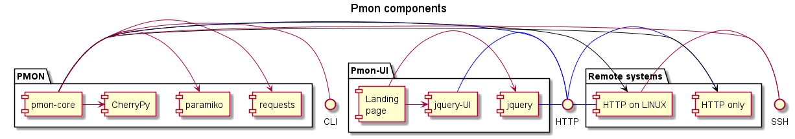

# Simple HTTP process monitor
This module allows to scan for responses of certain HTTP
addresses.

[License](./LICENSE)

## Method
Very simple: a series of URLs for GET requests is defined and
queried. The results are stored in a JSON data file. This file
is updated in subsequent executions.

## Requirements
- Python 3 installed. [Python](http://www.python.org)
- Module requirements are resolved by **setup.py**
- Internet connection for setup

## Overview



## Installation and execution
Fetch the source:

```bash
git clone git@github.com:bernd-clemenz/pmon.git
```

The tool is a simple Python 3 module it can be installed
manually into the local Python 3 environment by switching to
the directory with **pmon** files and executing

    python setup.py install
    
After installation it can be executed with the command

    python -m pmon [--conf=full-config-file-name] [--server=(True|False)] [--nomail=(True|False)]
    
If one does not want to install it, it can be run just by
switching to the directory and executing:

    python -m pmon
    
| Name | Description |
|------|-------------|
| conf | name of the configuration file |
| server | flag to start the internal HTTP server |
| nomail | flag to send **no** mail after processing | 

### Automated execution via 'cron'

>  @reboot      python -m pmon --conf=/configpath/pmon.ini --server=True --nomail=True

>  @daily       python -m pmon --conf=/configpath/pmon.ini
   
## Configuration
The module is configured via an traditional ini file. If no name
is given the config file name defaults to _pmon.ini_.

### Section 'pmon'
The general configuration of the tool.

| Name | Description |
|------|-------------|
| **id** | Identifies the instance of the monitor. Set it to a unique number |
| **data.file** | Name of the file, to store the results for further evaluation |
| **latest.file** | Name of JSON file for just the latest result. |
| **log.file** | Name of log output file |
| **log.level** |  Logging output level. Supported values are: DEBUG, INFO, WARN, ERROR, FATAL  |
| **timeout** | Wait for response in seconds until fail | 
| **http.port** | Port of http if the server module is started |
| **http.bind** | To what IP to bind the server, typically 0.0.0.0 |
| **http.public** | public directory for the UI |

### Section 'urls'
A dynamic section where the URLs for GET access are configured.
The entries follow the pattern **url.XX** where XX is a
number, unique to the section.

### Section 'remote'
This section contains sets keys prefixed with url-identifiers. The section
is also dynamic.

| Name | Description |
|------|-------------|
| url.XX.user | Name of a remote user |
| url.XX.pwd | Password |
| url.XX.process | string to search in command result |
| url.XX.scan_cmd | command to produce process list |
| url.XX.type | **ssh** only supported type in version 0.0.1 |
| url.XX.log.dir | location of the log directory to scan |
| url.XX.log.pattern | **grep** pattern to scan in logs |
| url.XX.log.files | glob for to select the log files to scan |


### Section 'email'
| Name | Description |
|------|-------------|
| server | mail server name or ip |
| port | the smtp port |
| pwd | the password of the mail sender |
| from | Mail address of the mail sender |
| to | comma separated list of mail addresses to notify |


### Example
    [pmon]
    id=isc_001
    data.file = pmon.json
    latest.file = current.json
    log.file = pmon.log
    log.level = INFO
    http.port = 8080

    [urls]
    url.1 = https://some-valid-url.io
    url.2 = http://invalid.url.io
    
    [remote]
    url.2.user = pi
    url.2.pwd = raspberry
    url.2.process = python com_srv.py
    url.2.scan_cmd = sudo ps aux
    url.2.type = ssh
    
## Result
Every execution adds to the URL-named lists. The result codes are:

| Code | Description |
|------|-------------|
| SUCCESS | All good |
| EXCEPTION_ERROR | Something in the environment went wrong, like network or system unavailable. |
| APPLICATION_ERROR | Service is there, but could not respond error-free to the request |

The rest of the entries are self-explanatory.

```javascript
{
    "http://invalid.url.io": [
        {
            "message": "HTTPConnectionPool(host='invalid.url.io', port=80):",
            "result": "EXCEPTION_ERROR",
            "time": "2018-07-17 00:16:53.259895"
        }
    ],
    "https://some-valid-url.io": [
        {
            "message": "OK",
            "result": "SUCCESS",
            "time": "2018-07-17 00:16:45.709041"
        }
    ],
    "https://some-valid-url.io/invalid-file.html": [
        {
            "message": 404,
            "result": "APPLICATION_ERROR",
            "time": "2018-07-17 00:16:55.263712"
        }
    ]
}
```

## Remote operations
The module can also perform some simple remote data digging, if access is configured.
For more complex things it's recommended to use tools like [Salt](http://www.saltstack.com).

## Copyrights
This repository contains Jquery and JqueryUI the copyrights remain with the respective owner(s).

## Hints
Create a virtual Python environment for the project and activate it with:

```bash
cd YOUR_PROJECT_HOME
source venv/Scripts/activate
```

## Additional sources
* [Paramiko](http://www.paramiko.org/)
* [Requests](http://docs.python-requests.org/en/master/)
* [ps command](https://kb.iu.edu/d/afnv)
* [Cherrypy](https://docs.cherrypy.org)
* [jQuery](https://www.jquery.com)
* [jQueryUI](https://www.jqueryui.com)